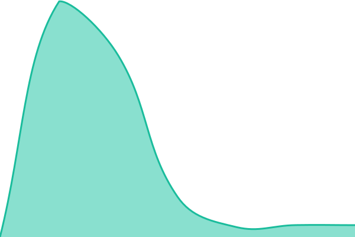

# [📈 Live Status](https://ut.uh.work.gd): <!--live status--> **🟩 All systems operational**

This repository contains the open-source uptime monitor and status page for [ber1yo](https://ut.uh.work.gd), powered by [Upptime](https://github.com/upptime/upptime).

With [Upptime](https://upptime.js.org), you can get your own unlimited and free uptime monitor and status page, powered entirely by a GitHub repository. We use [Issues](https://github.com/ber1yo/ut/issues) as incident reports, [Actions](https://github.com/ber1yo/ut/actions) as uptime monitors, and [Pages](https://ut.uh.work.gd) for the status page.

<!--start: status pages-->
<!-- This summary is generated by Upptime (https://github.com/upptime/upptime) -->
<!-- Do not edit this manually, your changes will be overwritten -->
<!-- prettier-ignore -->
| URL | Status | History | Response Time | Uptime |
| --- | ------ | ------- | ------------- | ------ |
|  [HKUST](https://hkust.edu.hk) | 🟩 Up | [hkust.yml](https://github.com/ber1yo/ut/commits/HEAD/history/hkust.yml) | 

 1800ms
     
 | 

<a href="https://ut.uh.work.gd/history/hkust">100.00%</a>
    

|  [HKUST Digital Humanities Initiative](https://digitalhumanities.hkust.edu.hk/) | 🟩 Up | [hkust-digital-humanities-initiative.yml](https://github.com/ber1yo/ut/commits/HEAD/history/hkust-digital-humanities-initiative.yml) | 

 1357ms
     
 | 

<a href="https://ut.uh.work.gd/history/hkust-digital-humanities-initiative">100.00%</a>
    

|  [HKUST Rare & Special e-Zone](https://lbezone.hkust.edu.hk/) | 🟩 Up | [hkust-rare-and-special-e-zone.yml](https://github.com/ber1yo/ut/commits/HEAD/history/hkust-rare-and-special-e-zone.yml) | 

 2235ms
     
 | 

<a href="https://ut.uh.work.gd/history/hkust-rare-and-special-e-zone">100.00%</a>
    

|  [HKUST Library](https://lbxibo.ust.hk/) | 🟩 Up | [hkust-library.yml](https://github.com/ber1yo/ut/commits/HEAD/history/hkust-library.yml) | 

 1269ms
     
 | 

<a href="https://ut.uh.work.gd/history/hkust-library">100.00%</a>
    

|  [HKUST Business School](https://bm.hkust.edu.hk) | 🟩 Up | [hkust-business-school.yml](https://github.com/ber1yo/ut/commits/HEAD/history/hkust-business-school.yml) | 

 963ms
     
 | 

<a href="https://ut.uh.work.gd/history/hkust-business-school">100.00%</a>
    

<!--end: status pages-->

[**Visit our status website →**](https://ut.uh.work.gd)

## 📄 License

- Powered by: [Upptime](https://github.com/upptime/upptime)
- Code: [MIT](./LICENSE) © [Anand Chowdhary](https://anandchowdhary.com)
- Data in the `./history` directory: [Open Database License](https://opendatacommons.org/licenses/odbl/1-0/)
